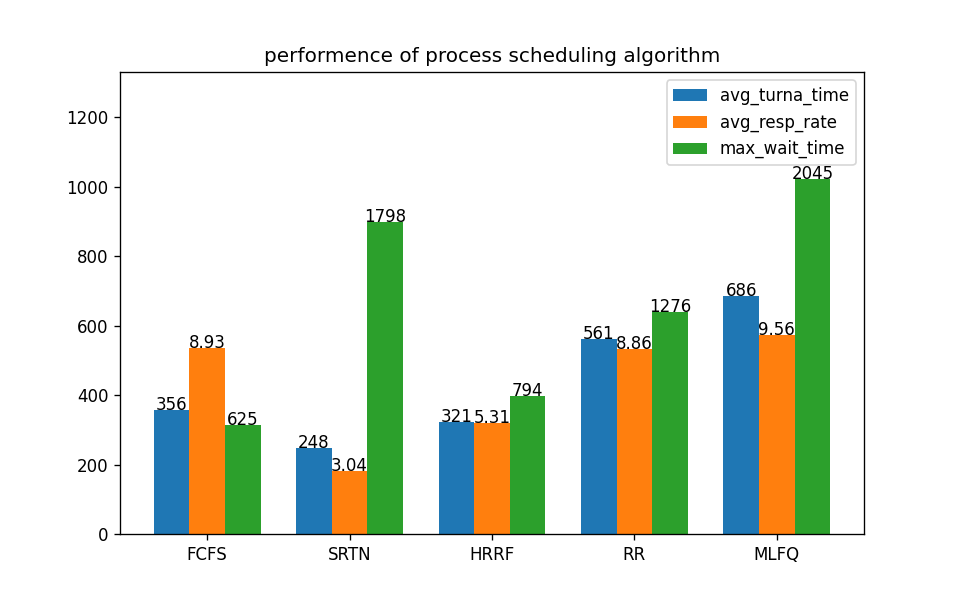

## 进程调度算法的模拟及分析

### 简介
- - - - - - - - - - - -
本项目是计科的一项实践作业，使用 Python 开发，模拟了各个进程调度算法，计算了平均周转时间、平均响应比及最大等待时间，并将结果绘制成了图表。模拟的进程调度算法有：

+ 先来先服务算法
+ 最短剩余时间优先算法
+ 最高响应比优先算法
+ 时间片轮转法
+ 多级反馈队列算法

### 开发环境
- - - - - - - - - - - -
* Python 3.10.2
* VSCode 1.77.3
* matplotlib 3.7.1 (Python 模块)

### 程序说明
- - - - - - - - - - - -
#### 主程序

主程序`procsched.py`执行过程分为以下几个步骤：
1. 载入配置
2. 生成进程序列
3. 模拟各个调度算法，得到周转时间
4. 计算平均周转时间、平均响应比及最大等待时间
5. 重复步骤 2.3.4. 多次，再将结果汇总
6. 绘制图表

相关代码如下：
```python
    config = load_config() # 载入配置

    for _ in range(config['sample_size']):
        arri_time, run_time = gen_proc_seq(config['proc']) # 生成进程序列

        turna_times['xxxx'] = XXXX(arri_time, run_time) # 调度算法模拟
        # ... ...

        for a in algos:
            results[a].append(calc_result(run_time, turna_times[a])) # 计算结果
    
    for a in algos:
        results[a] = summary(
            [r['avg_turna_time'] for r in results[a]],
            [r['avg_resp_rate'] for r in results[a]],
            [r['max_wait_time'] for r in results[a]]
        ) # 汇总
    
    print('results = ', results)
    draw_chart(results, config['proc']['avg_runtime'], 0.5) # 绘制图表
```

#### 配置文件

可以通过配置文件`config.json`修改程序运行的参数，如进程数量、样本数量等。  
各字段含义如下：

```json
{
    "proc" : {
        "avg_runtime" : 60, // 平均运行时间
        "diff_runtime" : 30, // 运行时间差
        "count" : 20, // 进程数量
        "latest_arri" : 1000 // 最晚到达时间
    },
    "algo" : {
        "slice_size" : 10, // 时间片大小
        "queue_level" : 4 // 队列级数
    },
    "sample_size" : 50 // 样本数量
}
```

#### 进程序列的生成

包括进程到达时间列表和进程运行时间列表。按下面的规则生成随机数：  
第1个进程到达时间为0，最后一个进程的到达时间为 `latest_arri`，其余进程的到达时间为 `[0, latest_arri]` 的均匀分布  
进程运行时间为 `μ=avg_runtime`，`σ=diff_tuntime` 的正态分布。由于运行时间必须是正数，生成的随机数为负或0时将重新生成，所以实际的平均运行时间往往略大于`avg_runtime`


### 算法实现
- - - - - - - - - - - -
实现各个算法的函数以进程到达时间列表`at`、进程运行时间列表`rt`为参数，返回进程周转时间列表`turna_time`
#### 先来先服务算法

算法的执行步骤如下：
1. 对 `i=0...count-1` 重复步骤 2-3
2. 运行 进程[i] 直至结束，计算 周转时间
3. 如果 进程[i] 不是最后一个进程，且 当前时间 < 进程[i+1]的到达时间，  
则 处理器空闲，等待 进程[i+1] 到达

代码实现：
```python
    for i in range(count):
        clock += rt[i]
        turna_time.append(clock - at[i])

        if i < count - 1 and clock < at[i+1]:
            clock = at[i+1]
```

#### 最短剩余时间优先算法

算法的执行步骤如下：
1. 对 `i=0...count-1` 重复步骤 2-5
2. 将 进程[i] 按 剩余时间 升序插入 活动进程列表
3. 如果 进程[i] 是最后一个进程，跳过步骤 4、5
4. 当 活动进程列表 不为空，且 当前时间 + 活动进程[0]的剩余时间 <= 进程[i+1]的到达时间，  
则 运行 活动进程[0] 直至结束，计算 周转时间，  
并从 活动进程列表 删除 活动进程[0]
5. 如果 活动进程列表 不为空，  
则 运行 活动进程[0] 直至 进程[i+1] 到达，  
否则 处理器空闲，等待 进程[i+1] 到达
6. 对于 活动进程列表 中的每一个 进程，   
运行 进程 直至结束，计算 周转时间

代码实现：
```python
    for i in range(count):
        insed = False
        for j in range(len(act_proc)):
            if remain_time[i] < remain_time[act_proc[j]]:
                act_proc.insert(j, i)
                insed = True
                break
        if not insed:
            act_proc.append(i)

        if i < count - 1:
            while act_proc and clock + remain_time[act_proc[0]] <= at[i+1]:
                clock += remain_time[act_proc[0]]
                turna_time[act_proc[0]] = clock - at[act_proc[0]]
                act_proc.pop(0)
            
            if act_proc:
                remain_time[act_proc[0]] -= (at[i+1] - clock)
            
            clock = at[i+1]
                    
    for p in act_proc:
        clock += remain_time[p]
        turna_time[p] = clock - at[p]
```

#### 最高响应比优先算法

算法的执行步骤如下：
1. 对 `i=0...count-1` 重复步骤 2-5
2. 将 进程[i] 插入 活动进程列表，对 活动进程列表 按 响应比 降序排序
3. 如果 进程[i] 是最后一个进程，跳过步骤 4、5
4. 当 活动进程列表 不为空，且 当前时间 + 活动进程[0]的剩余时间 <= 进程[i+1]的到达时间，  
则 运行 活动进程[0] 直至结束，计算 周转时间，  
从 活动进程列表 删除 活动进程[0]，  
并对 活动进程列表 按 响应比 降序排序
5. 如果 活动进程列表 不为空，  
则 运行 活动进程[0] 直至 进程[i+1] 到达，  
否则 处理器空闲，等待 进程[i+1] 到达
6. 对于 活动进程列表 中的每一个 进程，  
运行 进程 直至结束，计算 周转时间，   
并对 活动进程列表 按 响应比 降序排序

代码实现：
```python
    for i in range(count):
        act_proc.append(i)
        act_proc.sort(key=rr, reverse=True)

        if i < count - 1:
            while act_proc and clock + remain_time[act_proc[0]] <= at[i+1]:
                clock += remain_time[act_proc[0]]
                turna_time[act_proc[0]] = clock - at[act_proc[0]]
                act_proc.pop(0)
                act_proc.sort(key=rr, reverse=True)
            
            if act_proc:
                remain_time[act_proc[0]] -= (at[i+1] - clock)
            
            clock = at[i+1]
    
    while act_proc:
        clock += remain_time[act_proc[0]]
        turna_time[act_proc[0]] = clock - at[act_proc[0]]
        act_proc.sort(key=rr, reverse=True)
```

#### 时间片轮转法

算法的执行步骤如下：


代码实现：
```python
    i = 0
    while i < count or act_proc:
        if act_proc:
            if remain_time[act_proc[0]] <= ss:
                clock += remain_time[act_proc[0]]
                turna_time[act_proc[0]] = clock - at[act_proc[0]]
                act_proc.pop(0)
            else:
                clock += ss
                remain_time[act_proc[0]] -= ss
                act_proc.append(act_proc.pop(0))
        else:
            clock = at[i]

        while i < count and clock >= at[i]:
            act_proc.insert(0, i)
            i += 1
```

#### 多级响应队列算法

算法的执行步骤如下：


代码实现：
```python
    while i < count or not_empty(proc_lists):
        if not_empty(proc_lists):
            lvl = 0
            while not proc_lists[lvl]:
                lvl += 1
            cur_proc = proc_lists[lvl][0]

            if time_slice[lvl] == 0:
                time_slice[lvl] = ss * (2 ** lvl)
            time_slice[lvl] = min(time_slice[lvl], remain_time[cur_proc])
            
            if lvl > 0 and i < count and clock + time_slice[lvl] > at[i]:
                remain_time[cur_proc] -= (at[i] - clock)
                time_slice[lvl] -= (at[i] - clock)
                clock = at[i]
            else:
                clock += time_slice[lvl]
                remain_time[cur_proc] -= time_slice[lvl]
                time_slice[lvl] = 0

                if remain_time[cur_proc] == 0:
                    turna_time[cur_proc] = clock - at[cur_proc]
                    proc_lists[lvl].pop(0)
                else:
                    if lvl < ql - 1:
                        proc_lists[lvl+1].append(proc_lists[lvl].pop(0))
                    else:
                        proc_lists[lvl].append(proc_lists[lvl].pop(0))
        else:
            clock = at[i]

        while i < count and clock >= at[i]:
            proc_lists[0].insert(0, i)
            i += 1
    
```

### 运行示例
- - - - - - - - - - - -
进程数量 = 5，最晚到达时间 = 250， 样本数量 = 10 的模拟结果：


进程数量 = 20，最晚到达时间 = 1000， 样本数量 = 50 的模拟结果：


进程数量 = 50，最晚到达时间 = 2600， 样本数量 = 400 的模拟结果：


