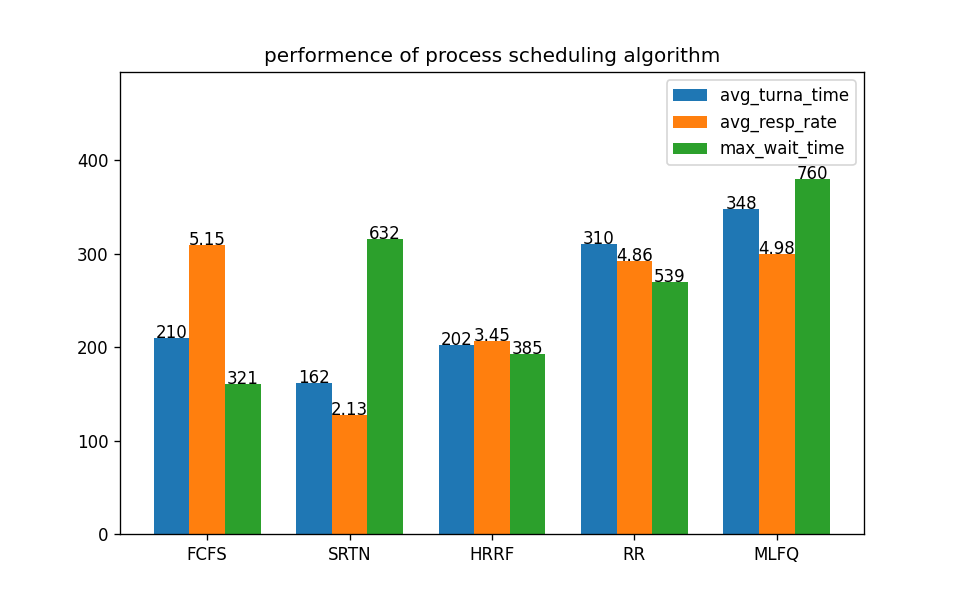

# 进程调度算法的模拟及分析

### 简介
- - - - - - - - - - - -
本项目是计科的一项实践作业，使用Python开发，模拟了各个进程调度算法，计算了平均周转时间、平均响应比及最大等待时间，并将结果绘制成了图表。模拟的进程调度算法有：

+ 先来先服务算法
+ 最短剩余时间优先算法
+ 最高响应比优先算法
+ 时间片轮转法
+ 多级反馈队列算法

### 开发环境
- - - - - - - - - - - -
* Python 3.10.2
* VSCode 1.77.3
* matplotlib 3.7.1 (Python 模块)

### 程序说明
- - - - - - - - - - - -

### 运行示例
- - - - - - - - - - - -
进程数量 = 5，最晚到达时间 = 250， 样本数量 = 10 的模拟结果：

进程数量 = 20，最晚到达时间 = 1000， 样本数量 = 50 的模拟结果：

进程数量 = 50，最晚到达时间 = 2600， 样本数量 = 400 的模拟结果：

